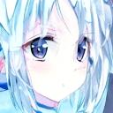
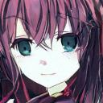

# DDPM Pytorch Inplement
A pytorch DDPM inplementation, simple to train and test on your dataset

## Requirement
python >= 3.10

torch >= 2.0

albumentations

numpy
## Quick Start
### Training
First prepare your dataset.For simplest method, put your images(.jpg or .png format, rgb images) into data/images, or you can organize your images as pytorch image folder, and change dataset_path in config.yaml to your folder.
 
Then you can change options in config.yaml according to your preference, like batch_size, gpus, image resolutions etc.
 
After prepared data and set configs, just run "python train.py" to train your DDPM model, images generated after training each epoch will be saved in exp/generated by default.Model weights and optimizer state will be saved as exp/model.pth and exp/training_params.pt respectively after training is finished.

### Testing(Generating Images)
After the training process is finished, you can simply run "python test.py" to generate images from trained model, generated images will be saved in exp/generated_test by default.
## Generated Examples
Here are some real and generated examples of [konachan anime faces dataset](https://aistudio.baidu.com/datasetdetail/110820/0).Resolution of example images have been resized to 128x128 considering training cost.

Images from dataset

Images generated

## Acknowledgements
UNet model used implementation of zoubohao:
 
https://github.com/zoubohao/DenoisingDiffusionProbabilityModel-ddpm-?tab=readme-ov-file